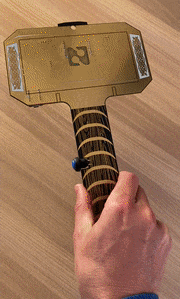

# Hammer of Blues

*It's the Hammer of Blues!*

The Hammer of Blues is an ML &amp; IoT development board used in a variety of 
workshops by [Blues Wireless](https://blues.io/).

Read more about the 
[Hammer of Blues on Hackster](https://www.hackster.io/rob-lauer/next-level-ml-iot-workshop-with-hammer-of-blues-wireless-e7424f).

